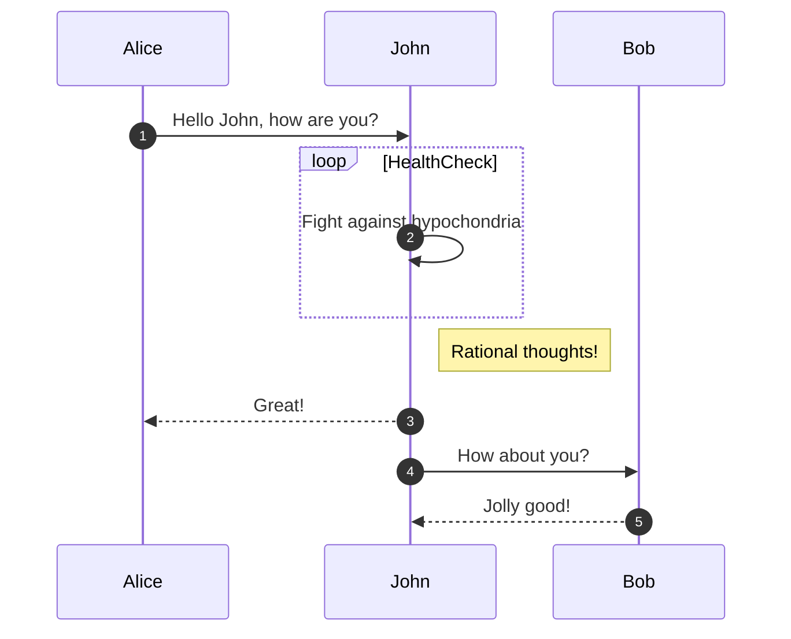

# Documenting Python Code

## Introduction

Did you ever wonder how [the Brightway documentation](https://docs.brightway.dev/en/latest/) (or Pandas/NumPy/SciPy... documentation) is built?

The answer is: the [Sphinx documentation generator](https://www.sphinx-doc.org/en/master/)! \
This tool _automatically_ builds fancy documntation websites... as long as you properly document your Python source-code.

To do that, you must:

1. Choose a [Python docstring](https://peps.python.org/pep-0257/#what-is-a-docstring) style (we recommend [the NumPy Style](https://numpydoc.readthedocs.io/en/latest/format.html))
2. Document your functions, classes and methods!

You can also add more extensive descriptions (text with images, tables, etc.) to the documentation. We recommend you write this content in [MyST Markdown](https://myst-parser.readthedocs.io/en/latest/index.html).

For inspiration on how you can structure your documentation, you can have a look at [the Brightway documentation repository.](https://github.com/brightway-lca/brightway-documentation/tree/main/source)

## Site Syntax (Markdown/MyST and ReStructuredText)


## Build Process

> [!NOTE]
> We assume you have already created [a Brightway project from the cookiecutter template](https://github.com/brightway-lca/cookiecutter-brightwaylib) and know how to use Conda/Mamba to manage your environment.

1. Create the Sphinx documentation Conda environment from the `environment.yaml` file:

```bash
conda env create -f docs/environment.yaml
```

2. Activate the environment:

```bash
conda activate sphinx_<your_project_name>
```

3. Build the documentation using the command provided in the readme file:

```bash
sphinx-build docs _build/html --builder=html --jobs=auto --write-all; open _build/html/index.html
```

## Publication Process

You can host your documentation on [Read the Docs (RTD)](https://readthedocs.org/). This service will automatically build your documentation whenever you push to your repository.

The Brightway project repository structure is already set up to work with RTD. Simply [add your project following the instructions on the RTD website](https://docs.readthedocs.io/en/stable/intro/add-project.html).

## Useful Sphinx Features

### `autoapi` Extension

The `autoapi` extension is a Sphinx extension that automatically generates API documentation from your Python source code. This is particularly useful for documenting functions, classes, and methods in your codebase.

> [!WARNING]
> [At the moment](https://github.com/readthedocs/sphinx-autoapi/issues/287), the `autoapi` extension does not support Markdown. This means that you must write your API documentation in ReStructuredText (RST).
> 
> This means that hyperlinks, tables etc. must be written in rst syntax. For example:
> 
> ```rst
> `Google Homepage <https://www.google.com>`_
> 
> +-----------+-----------+
> | Column 1  | Column 2  |
> +===========+===========+
> | Banana    | Apple     |
> +-----------+-----------+
> | Apricot   | Coconut   |
> +-----------+-----------+
> ```

### `intersphinx` Linking

What if you are using a `bw2data` function in your code, and you want to link to the relevant `bw2data` documentation? This would help your users understand what the function does, and how to use it. Fortunately, Sphinx has [a core feature called `intersphinx`](https://docs.readthedocs.io/en/stable/guides/intersphinx.html) that allows you to link to external documentation:

> [!TIP]
> Brightway is already pre-configured to use `intersphinx` linking under the abbreviation `bw`.

[Using the syntax `inv:bw#<your_link_target>`](https://myst-parser.readthedocs.io/en/latest/syntax/cross-referencing.html#cross-project-intersphinx-links), you can link to any page in the Brightway documentation. For example, you can link to pages:

```
[Installation Page](inv:bw#content/installation/index)
```

or to functions in the auto-generated API documentation:

```
<inv:bw#bw2io.export.excel.lci_matrices_to_excel>
```

### `glossary` Directive

A core feature of Sphinx is the [`glossary` directive](https://www.sphinx-doc.org/en/master/glossary.html). This directive allows you to define terms and their definitions in a central location, and then reference them throughout your documentation. This is particularly useful for technical documentation of scientific software, where you may need to define terms that are not commonly understood.

> [!TIP]
> You can check out [the Brightway Documentation glossary page](https://github.com/brightway-lca/brightway-documentation/blob/main/source/content/overview/glossary.md) for inspiration.

The basic syntax is simple: Just add a `glossary` directive to any of your `.md` files, and start adding terms like so:

````
```{glossary}

Activity
    An `activity` in Brightway is the name used for both processes and elementary flows. Other terms used frequently:

    | Source | Terminology |
    | ------ | ----------- |
    | Brightway | `activity` |
    | ISO | `(unit) process` or `elementary flow`[^1]
    | [Ghose et al. (2021)](https://doi.org/10.1111/jiec.13220) | `Activity` |

```
````

Now you can simply reference the term `Activity` in your documentation, and Sphinx will automatically link to the definition:

```
Bla bla bla {term}`activity`...
```

> [!TIP]
> The reference is NOT case sensitive. You can write either `{term}`activity` or `{term}`Activity`.

### Third-Party Directives (eg. `sphinxcontrib-mermaid`)

There are many third-party Sphinx extensions that can be used to add more functionality to your documentation.

One extension is particularly useful for adding software diagrams to your documentation: [`sphinxcontrib-mermaid`](https://github.com/mgaitan/sphinxcontrib-mermaid). With this extension, you can write diagrams in code that will be rendered as images in your documentation (example taken [from the Mermaid documentation](https://mermaid.js.org/syntax/sequenceDiagram.html#sequencenumbers)):

```
sequenceDiagram
    autonumber
    Alice->>John: Hello John, how are you?
    loop HealthCheck
        John->>John: Fight against hypochondria
    end
    Note right of John: Rational thoughts!
    John-->>Alice: Great!
    John->>Bob: How about you?
    Bob-->>John: Jolly good!
```



This means that it is possible to include UML diagrams, flowcharts, and other types of diagrams in your documentation. Of course, you can hyperlink elements in the diagram to other parts of your documentation 🤯

#### Third-Party Directive Setup

If you want to add a third-party directive to your Sphinx documentation, you must:

1. Add the associated Python package to the `environment.yaml` file:

```yaml
 - sphinxcontrib-mermaid=0.9.2 # https://anaconda.org/conda-forge/sphinxcontrib-mermaid/files
```

2. Add the directive to the `extensions` list of the `conf.py` file:

```python
extensions = [
    (...)
    # Mermaid diagram support
    "sphinxcontrib.mermaid",
    (...)
]
```

3. Configure the extension by setting options in the `conf.py` file. Many extensions have important configuration options that you need to set before using it. The `sphinxcontrib-mermaid` extension [lists these options in the package documentation](https://sphinxcontrib-mermaid-demo.readthedocs.io/en/latest/#config-values).

In this case we are lucky - wo don't _need_ to set any option. It works fine out of the box.